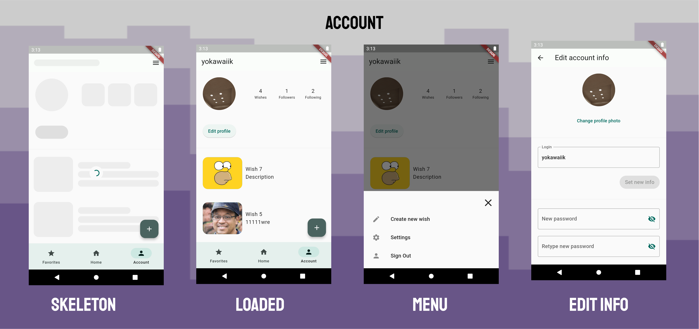
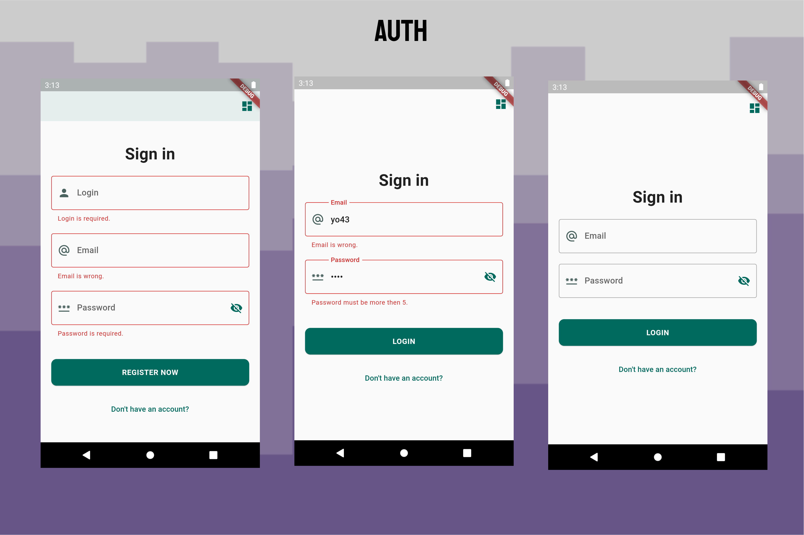
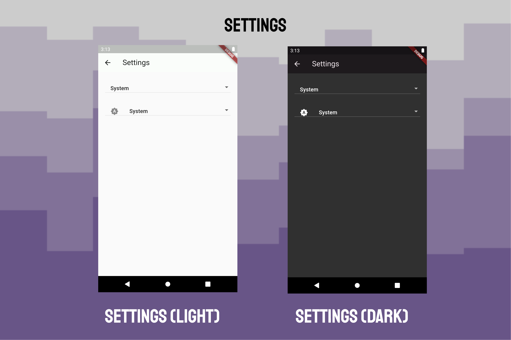

# Wish App (MVP pet project)

Created this application with Material Design 3.0, Getx, Supabase and Isar database to learning, showing my skills in Flutter programming and PostgreSQL. This application can convinient to save wish and share its to your friends, add wishes to favorites to note what will you buy to your friend on it Birthday

## Content table

- [Wish App (MVP pet project)](#wish-app-mvp-pet-project)
  - [Content table](#content-table)
  - [Used stack](#used-stack)
  - [Features](#features)
    - [Global](#global)
    - [Authentication page](#authentication-page)
    - [Home page](#home-page)
    - [Favorites page](#favorites-page)
    - [Account page](#account-page)
    - [Settings page](#settings-page)
    - [Wish info](#wish-info)
    - [Add Wish](#add-wish)
  - [Ways of improving](#ways-of-improving)
  - [App demonstration](#app-demonstration)
    - [Video demonstration](#video-demonstration)
    - [App download](#app-download)
  - [How to launch app](#how-to-launch-app)
    - [Supabase](#supabase)
  - [Author contacts](#author-contacts)
  - [License](#license)

## Used stack

- [GetX](https://pub.dev/packages/get): Easy and powerful state management framework with useful UI tricks.
- [Get Storage](https://pub.dev/packages/get_storage): A fast, extra light and synchronous key-value in memory, which backs up data to disk at each operation. Used it for save app options.
- [Supabase](https://supabase.com/): Supabase is an open source Firebase alternative. It's better thanks to PostgreSQL, RPC and other useful things on the backend side. Used it like a backend.
- [Isar](https://isar.dev/): NoSQL, Cross Platform Database like [Hive](https://docs.hivedb.dev/) but new better. Used it for saving user actions (save to storage when click on list tile) when user search other users and wishes (search on the Main Screen).
- Others package for UI and utils: flutter_dotenv (set config app), image_picker, connectivity_plus (checks internet connection), emojis, flutter_staggered_grid_view (gridview on steroids), flutter_slidable (to remove item from search suggestions). 

## Features

### Global
- [x] Navigation with bottom navigator bar;
- [x] Parallel routing on home page to open another user account;
- [x] Locale English and Russian languages;
- [x] Skeleton Widgets to show somethink while loading.

### Authentication page
- [x] Data validation in form;
- [x] Sign in;
- [x] Sign up.

### Home page
- [x] Click on items in the MasonryGridView to: add to favorites, remove from favorites. If wish created by user then can delete wish;
- [x] Infinite scroll in MasonryGridView;
- [x] Look for users ad wishes with search in Appbar (with save last oppened users and wishes to Isar database to show saggestions).

### Favorites page
- [x] Remove from favorites;
- [x] Sign out from account;
- [x] Infinite scroll in GridView.

### Account page
- [x] Infinite scroll in GridView with showing Skeleton items while app weren't load all user wishes.
- [x] If shows another user then can subscribe to another user, add and remove it wishes to your favorite list. 
- [x] If shows current user then can edit current user info and load new avatar image.

### Settings page
- [x] Set language with saving current value to GetStorage box;
- [x] Set theme with saving current value to GetStorage box.

### Wish info
- [x] See detail wish info;
- [x] If wish created by current user then can edit this wish;

### Add Wish
- [x] Fill in values to fields;
- [x] Select image;
- [x] Save new wish and it will be added to Home page and Account Page.

## Ways of improving
- [ ] Personal user themes with saving it on Supabase;
- [ ] Redesign: Favorites page, Info page;
- [ ] Sort wishes by categories;
- [ ] Create parrallel router stack instead of navigator view;
- [ ] Realtime update user Home page;

## App demonstration

\
\

\
\

\
\

\
\

\
\

### Video demonstration

[Youtube link](https://www.youtube.com/watch?v=mACMSRsb1U0&t=2s)

### App download

[App download](https://drive.google.com/file/d/10nmPqBF1d52CqPSSs3prhwjb5CmO04df/view?usp=sharing)

## How to launch app

### Supabase

1. Sign up to Supabase;
2. Set up Supabase with [Supabase README.md](./supabase/README.md.md);
3. Get and paste data to environments from Supabase project: SUPABASE_ANNON_KEY, SUPABASE_URL. You can find environments dot files (.env.production, .env.development) in root flutter project.

## Author contacts

Made by @yokawaiik

  
  
  
  

## License

GPL
